# Project Akhir Pemorgraman Mobile (List Produk IT)

## Halaman Awal
Pada halaman awal ini terdapat button login dan register

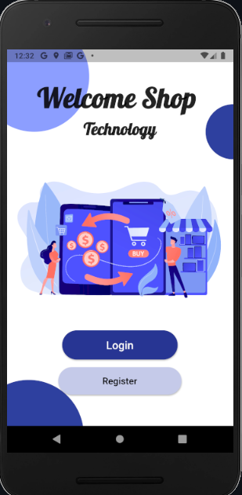

## Halaman Login
pada login terdapat login dengan google atau dengan email&password

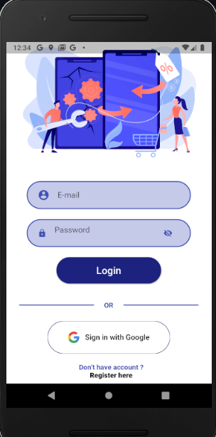

## Halaman Register
Halan Regiter email&password

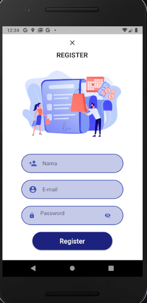

## Halaman Sukses Login

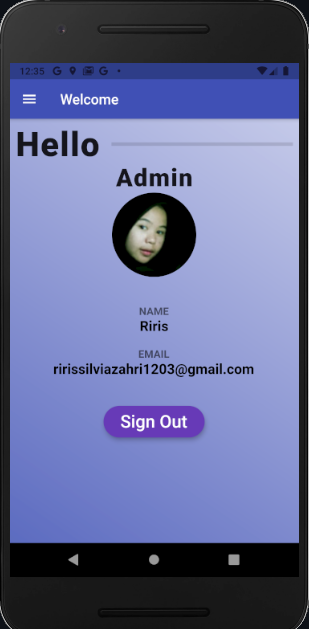

## Drawer
Pada drawer ini terdapat menu produk,kategori dan keluar 

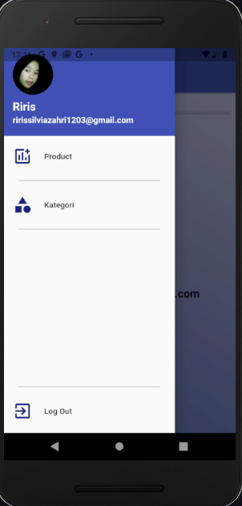

## Halaman CRUD produk
Pada halaman ini terdapat list data produk,add data produk,edit data produk dan hapus data produk 
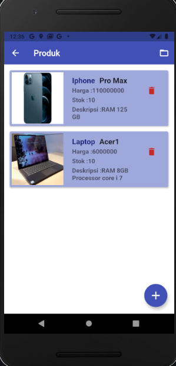
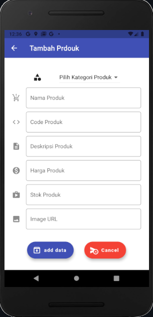
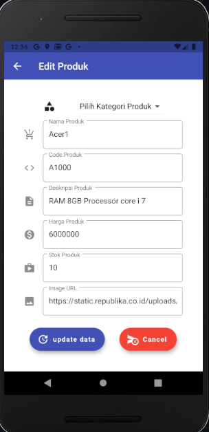
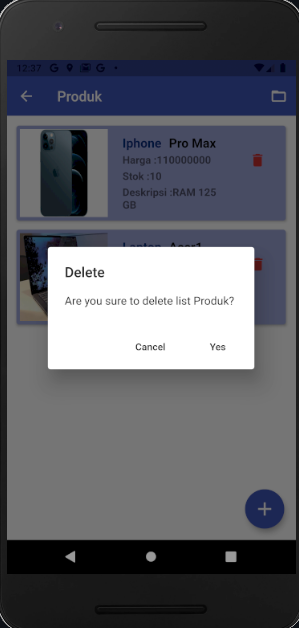

## Halaman Detail Produk

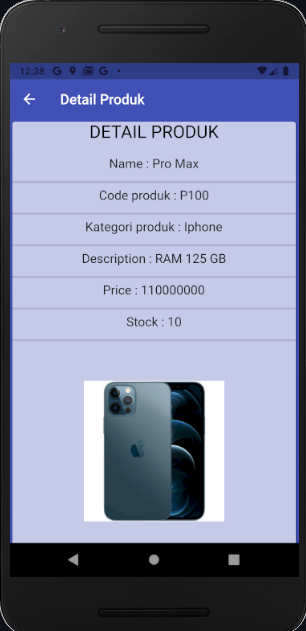

## Halaman CRUD Kategori
Pada halaman ini terdapat list data kategori,add data Kategori,edit data kategori dan hapus data Kategori.

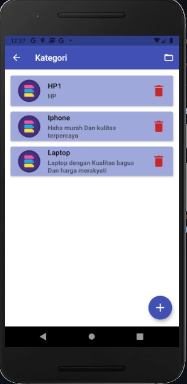
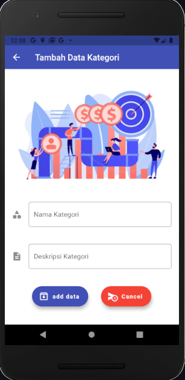
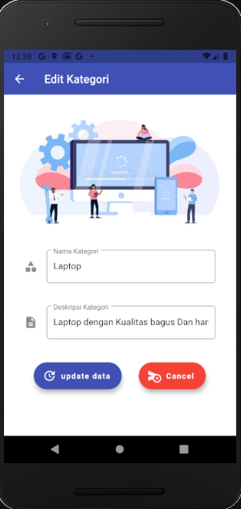
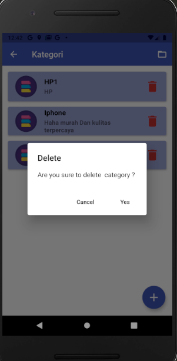

## Halaman Detail Kategori

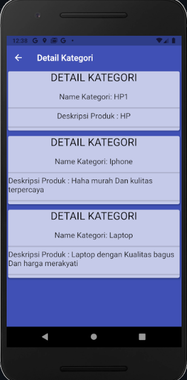

## Getting Started

This project is a starting point for a Flutter application.

A few resources to get you started if this is your first Flutter project:

- [Lab: Write your first Flutter app](https://flutter.dev/docs/get-started/codelab)
- [Cookbook: Useful Flutter samples](https://flutter.dev/docs/cookbook)

For help getting started with Flutter, view our
[online documentation](https://flutter.dev/docs), which offers tutorials,
samples, guidance on mobile development, and a full API reference.
